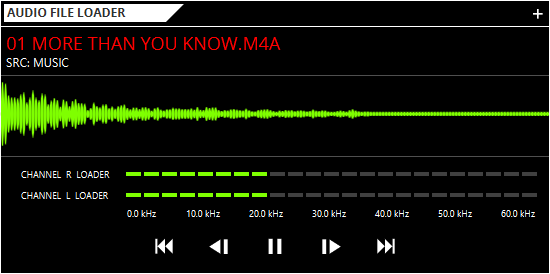
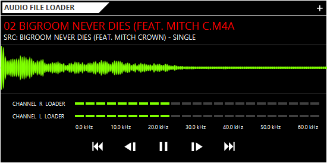

# AudioPlayer
<p align="justify">
This is application for play audio file and display band visualizer. 
</p>

## Technologies
* Java 8
* JavaFX 
* [JFeonix](http://www.jfoenix.com/) - JavaFX Material Design Library
* [FontAwesomeFX](https://www.jensd.de/wordpress/) - Font Icon for JavaFX 
* [AnimateFX](https://typhon0.github.io/AnimateFX/) - Animations for JavaFX


## Build With
* [Maven](https://maven.apache.org/) - Dependency Management

## Installing

Run project via terminal 
```
cd ../AudioPlayer

mvn clean compile exec:java
```

Execute .jar file
```
cd ../AudioPlayer/target

java -jar AudioPlayer-1.0.jar
```

## Screenshot
<p align="center">
  
</p>

<p align="center">
  
</p>

## Authors
* **Rasio Ganang Atmaja**


